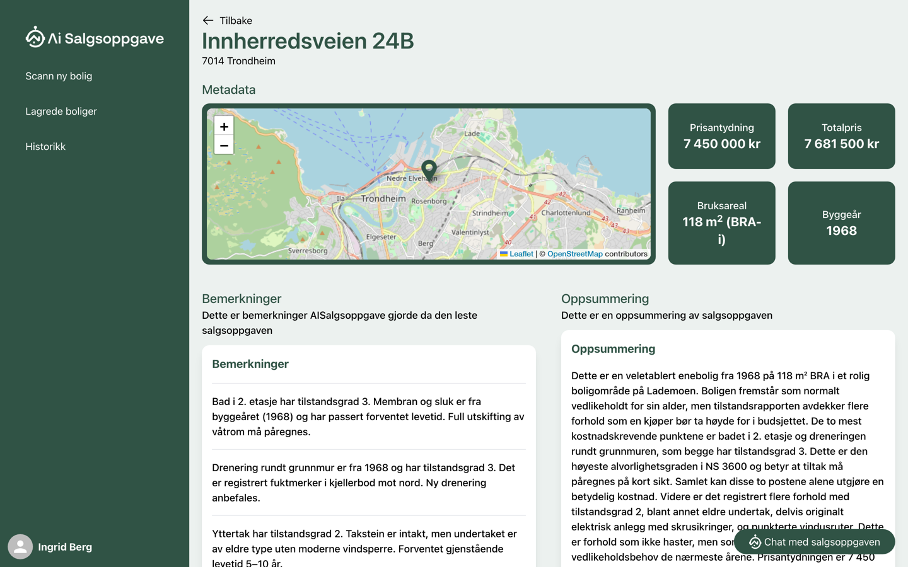
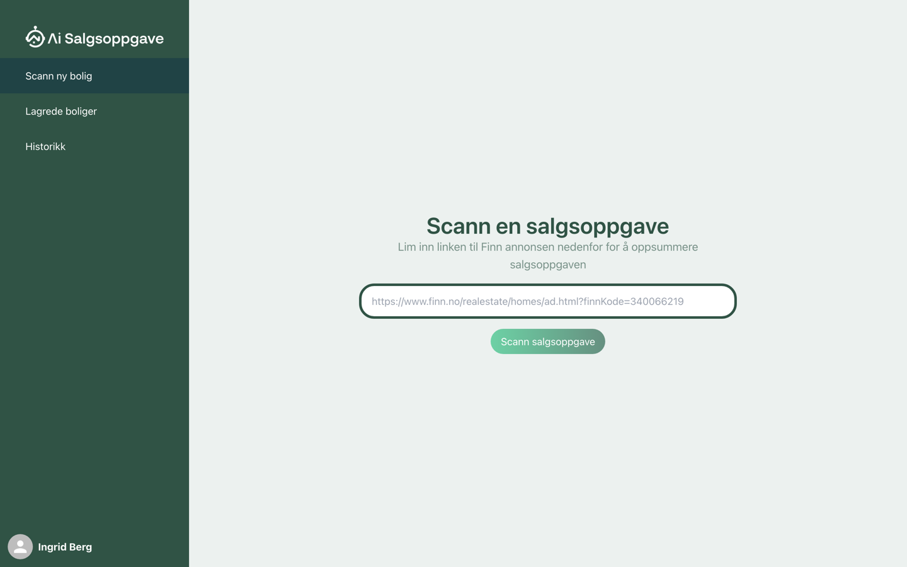
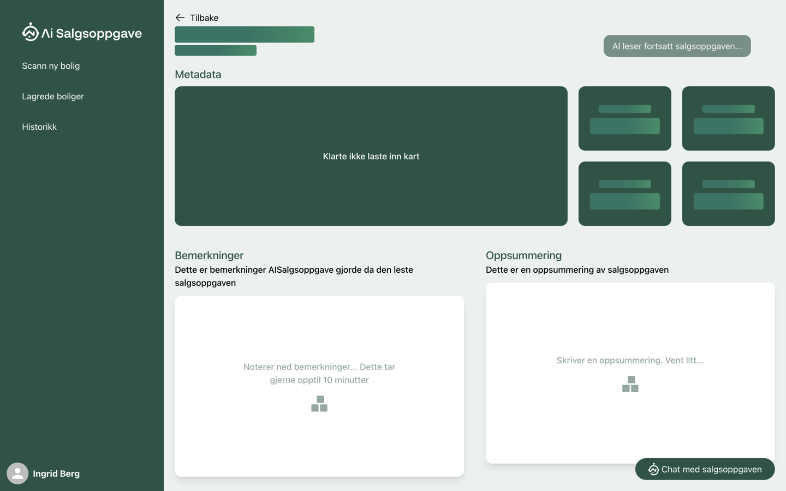
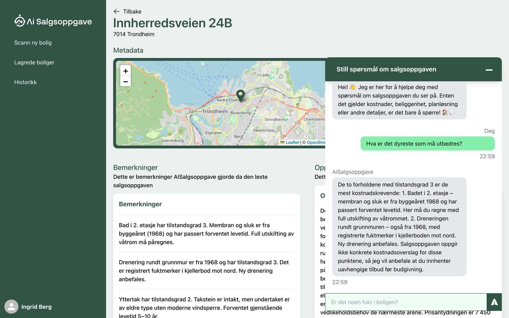
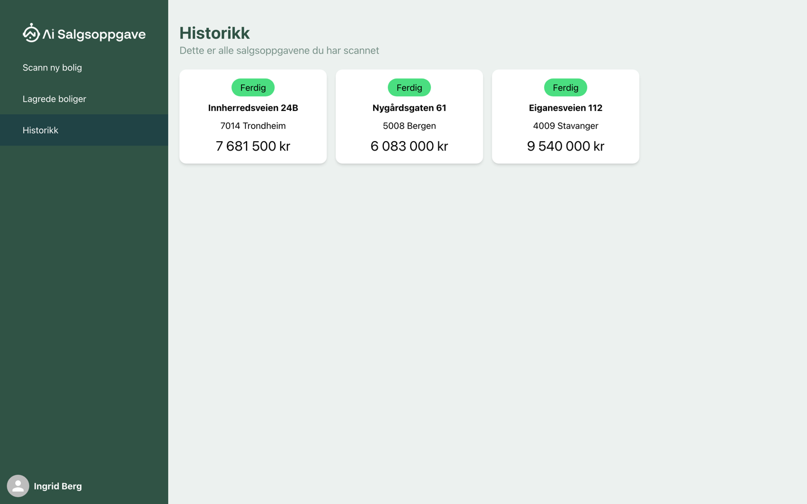

<div align="center">

# AI Salgsoppgave

**Lim inn en Finn-annonse. Få salgsoppgaven lest, oppsummert og forklart av AI.**

En norsk tjeneste som laster ned salgsoppgaven til en boligannonse, leser den med
språkmodeller, trekker ut nøkkeltall og bemerkninger – og lar deg stille spørsmål
til dokumentet.

[](LICENSE)




</div>

---

> [!NOTE]
> **Tjenesten er gratis og uten betaling.** aisalgsoppgave.no ble opprinnelig drevet
> med Stripe-abonnement og månedskvote. Alt det er fjernet – du kjører den selv, med
> dine egne API-nøkler, uten begrensninger. Det finnes heller ingen sporing:
> PostHog og Facebook Pixel er tatt helt ut.

## Innhold

- [Hva er dette?](#hva-er-dette)
- [Kom i gang](#kom-i-gang)
- [Skjermbilder](#skjermbilder)
- [Slik virker det](#slik-virker-det)
- [Teknologi](#teknologi)
- [Konfigurasjon](#konfigurasjon)
- [Utvikling uten Docker](#utvikling-uten-docker)
- [Prosjektstruktur](#prosjektstruktur)
- [Videre lesning](#videre-lesning)
- [Bidra](#bidra)
- [Lisens](#lisens)

## Hva er dette?

Når du kjøper bolig i Norge, får du en **salgsoppgave**: et PDF-dokument på gjerne
60–150 sider med tilstandsrapport, egenerklæring, takst, reguleringsplaner og
kjøpekontrakt. Det viktigste – hva som faktisk er galt med boligen – ligger begravd i
et vedlegg midt i dokumentet.

AI Salgsoppgave gjør denne jobben for deg:

1. Du limer inn lenken til en Finn-annonse (eller laster opp en PDF selv).
2. Tjenesten finner og laster ned den komplette salgsoppgaven fra meglerens nettsted.
3. Dokumentet indekseres i en vektordatabase, og en kjede av språkmodell-steg trekker
   ut adresse, nøkkeltall og bemerkninger, og skriver en oppsummering.
4. Du får resultatet i et dashboard – og kan stille spørsmål direkte til dokumentet.

**Ordliste for ikke-norsktalende lesere:** *salgsoppgave* = prospectus,
*bemerkning* = remark/defect, *bolig* = home, *megler* = estate agent,
*tilstandsgrad* (TG0–TG3) = condition grade from the Norwegian building survey
standard NS 3600.

## Kom i gang

Du trenger **Docker** og to API-nøkler – én fra
[Anthropic](https://console.anthropic.com/settings/keys) og én fra
[OpenAI](https://platform.openai.com/api-keys).

```bash
cp .env.example .env     # lim inn de to nøklene
docker compose up
```

Det er alt. Compose bygger backend og frontend, starter PostgreSQL med pgvector, og
kjører databasemigrasjonene automatisk.

- Frontend: <http://localhost:3000>
- Backend: <http://localhost:8080>

Første bygg tar noen minutter fordi Maven og npm laster ned avhengigheter. Senere
oppstarter er raske.

```bash
docker compose down       # stopp
docker compose down -v    # stopp og slett databasen
```

> Appen starter også helt uten nøkler – du kommer inn og kan opprette bruker, men
> selve analysen feiler når den skal kalle modellen.

## Skjermbilder

> Skjermbildene er tatt av den kjørende frontend-appen med **representative
> demodata**, ikke fra en ekte AI-analyse. Adresse, tall og tekst er konstruert for
> illustrasjon.

|                                                              |                                                          |
| ------------------------------------------------------------ | -------------------------------------------------------- |
| **Lim inn en Finn-lenke**<br> | **Analysen pågår**<br> |
| **Chat med salgsoppgaven**<br> | **Historikk**<br> |

## Slik virker det

Kjernen i systemet er en **kjede av «providers»** som kjører etter tur på hver jobb.

```
Finn-URL
   │
   ▼
┌──────────────────────────────────────────────────────────────────────┐
│ SalgsoppgaveJobService.createJob()                                   │
│  • dedupliserer på URL                                               │
│  • laster ned i en CompletableFuture (HTTP-kallet returnerer straks) │
└──────────────────────────────────────────────────────────────────────┘
   │
   ├── FinnScraper  – jsoup + et LLM-kall for å plukke riktig lenke
   └── PdfUtils     – trekker ut teksten til SalgsoppgaveJob.pdfContent
   │
   ▼
┌──────────────────────────────────────────────────────────────────────┐
│ DataProvidersManagerService – kjører alle lyttere sekvensielt,       │
│ sortert på getOrder()                                                │
└──────────────────────────────────────────────────────────────────────┘
   │
   ├─  0  AddressProvider       adresse + koordinater (GeocodingService)
   ├─ 10  TextSplitterProvider  deler opp teksten og fyller vektorlageret
   ├─ 10  MetricsProvider       prisantydning, totalpris, bruksareal, byggeår
   ├─ 90  SummaryProvider       oppsummeringen
   └─101  RemarksProvider       bemerkninger (TG2/TG3-funn)
   │
   ▼
JobStatus: VISITING_FINN → VISITING_MEGLER → DOWNLOADING_PROSPECT
        → CREATING_EMBEDDINGS → LLM_IN_PROGRESS → COMPLETED / FAILED
```

Tre ting er verdt å merke seg:

- **Providere registrerer seg selv.** Hver `DataProvider`-subklasse kaller
  `subscribeToNewSalgsoppgaveJob(this)` i konstruktøren sin. Det finnes ikke noe
  eksplisitt register – det holder å legge til en `@Component` som utvider
  `DataProvider` for å få den inn i kjeden.
- **`TextSplitterProvider` (order 10) fyller vektorlageret.** Alt som kaller
  `searchVectorStoreFor` må derfor ha høyere order enn 10.
- **En provider må si fra at den er ferdig.** Den kaller
  `markSalgsoppgaveJobAsFinished(job)`. En planlagt jobb (hvert 2. sekund) finner
  snittet av alle providernes `finished`-lister, og en jobb som ligger i *alle*
  listene settes til `COMPLETED`. En provider som returnerer uten å kalle metoden,
  etterlater jobben i `LLM_IN_PROGRESS` for alltid.

Mer detaljert gjennomgang – sikkerhet, persistens og API – finnes i
[`docs/ARKITEKTUR.md`](docs/ARKITEKTUR.md).

## Teknologi

| Lag         | Teknologi                                                                     |
| ----------- | ----------------------------------------------------------------------------- |
| Backend     | Java 21, Spring Boot 3.4, Spring AI 1.0.0, Maven                               |
| Database    | PostgreSQL med [pgvector](https://github.com/pgvector/pgvector), Liquibase     |
| Språkmodell | Anthropic Claude (chat), OpenAI `text-embedding-3-small` (embeddings)          |
| Frontend    | React 18, TypeScript, Create React App, Tailwind CSS, MUI, framer-motion       |
| Innlogging  | Spring Security, skjemainnlogging + valgfri Google/Facebook OAuth2             |
| Drift       | Docker Compose. Ingen CI/CD følger med – se docs/ARKITEKTUR.md                 |

## Konfigurasjon

All konfigurasjon er miljøvariabler med fornuftige standardverdier, samlet i
[`.env.example`](.env.example). Bare de to første må settes.

| Variabel                        | Standard                    | Beskrivelse                                    |
| ------------------------------- | --------------------------- | ---------------------------------------------- |
| `ANTHROPIC_API_KEY`             | tom                         | Claude. Uten den feiler analysen.              |
| `OPENAI_API_KEY`                | tom                         | Embeddings. Uten den feiler analysen.          |
| `ANTHROPIC_MODEL`               | `claude-sonnet-4-5`         | Hvilken Claude-modell som brukes.              |
| `SPRING_DATASOURCE_URL`         | lokal postgres              | Databasen.                                     |
| `SALGSOPPGAVE_DATADIR`          | `../data/files`             | Hvor opplastede filer lagres.                  |
| `BACKEND_URL`                   | `http://localhost:8080`     | Offentlig adresse til backend.                 |
| `ENVIRONMENT`                   | `DEVELOPMENT`               | `PRODUCTION`, `STAGING` eller `DEV`.           |
| `OAUTH2_*`                      | `not-configured`            | Google-/Facebook-innlogging. Valgfritt.        |
| `SPRING_MAIL_*`                 | tom                         | Utgående e-post. Valgfritt.                    |
| `MAILCHIMP_*`, `DISCORD_*`      | tom                         | Nyhetsbrev og varsler. Valgfritt.              |
| `LOG_LEVEL`                     | `info`                      | `debug` gir detaljert logg.                    |

Frontend har egen konfigurasjon i `frontend/.env` (bare offentlige URL-er, ligger i
Git). I Docker settes de som byggeargumenter, fordi Create React App baker dem inn i
bygget.

## Utvikling uten Docker

Vil du kjøre backend og frontend direkte – med hot reload og debugger – trenger du
Java 21, Node 18+ og en PostgreSQL med pgvector.

```bash
# 1. Bare databasen fra Compose
docker compose up -d postgres

# 2. Backend
cd backend
export ANTHROPIC_API_KEY=sk-ant-... OPENAI_API_KEY=sk-...
./mvnw spring-boot:run

# 3. Frontend
cd frontend && npm install && npm start
```

Ingen Spring-profiler trengs lenger: `application.properties` har standardverdier for
lokal kjøring, og alt kan overstyres med miljøvariabler.

### Tester

```bash
cd backend
./mvnw test                                    # alle tester
./mvnw test -Dtest=MetricsProviderTest         # én testklasse
```

Testene leser PDF-er fra katalogen `SALGSOPPGAVE_DATADIR` peker på.

### Tunnel (valgfritt)

OAuth-redirects må kunne nå maskinen din utenfra:

```bash
cp pinggy.sh.example pinggy.sh && chmod +x pinggy.sh && ./pinggy.sh
```

Sett så `BACKEND_URL` til adressen tunnelen gir deg.

## Prosjektstruktur

```
.
├── backend/                     Spring Boot-applikasjonen
│   └── src/main/java/com/johansvartdal/SpringAI/
│       ├── annotation/          @NoLogin, @NoCors, @NoSecurity
│       ├── authentication/      Spring Security, OAuth2, sesjoner
│       ├── controller/          REST-API under /api/v1
│       ├── model/               JPA-entiteter
│       ├── provider/            ★ kjeden som analyserer salgsoppgaven
│       ├── repository/          Spring Data-repositorier
│       ├── service/             Forretningslogikk, Finn-scraping
│       └── utils/               PDF, geokoding, miljø, formatering
├── frontend/                    React-applikasjonen
│   └── src/
│       ├── components/          Gjenbrukbare komponenter
│       ├── pages/               Én katalog per side
│       ├── providers/           React-context (bruker, jobb)
│       ├── types/               Speiler backend-entitetene
│       └── enums/               Speiler backend-enumene
├── docs/                        Dokumentasjon og skjermbilder
├── docker-compose.yml           Hele stacken lokalt
└── docker-compose.prod.yml      Utgangspunkt for drift på egen server
```

## Videre lesning

- [`docs/ARKITEKTUR.md`](docs/ARKITEKTUR.md) – arkitektur i dybden.
- [`CONTRIBUTING.md`](CONTRIBUTING.md) – hvordan bidra.
- [`SECURITY.md`](SECURITY.md) – hvordan melde fra om sårbarheter.
- [`CLAUDE.md`](CLAUDE.md) – kortfattet orientering for AI-kodeassistenter.

## Bidra

Bidrag er velkomne – se [`CONTRIBUTING.md`](CONTRIBUTING.md). Prosjektet vedlikeholdes
ikke aktivt, så svartiden kan være lang.

## Lisens

[MIT](LICENSE) © Johan Svartdal

Ansvarsfraskrivelse: dette er et hobbyprosjekt. Utdata fra språkmodeller kan være feil
eller ufullstendige, og må ikke brukes som eneste grunnlag for en boligkjøpsbeslutning.
